# TokTickIT — Lab 3 Submission
## Multi-Role Ticketing, IT Staff Operations & Administrator User Management
**Course:** CPE 334 Software Engineering in the Age of AI Agents — KMUTT  
**Semester:** 1/2026  

| Item | Student & Project Information |
|:---|:---|
| **Name** | Nara Kosiyaporn |
| **Student ID** | 67070505218 |
| **GitHub Username** | [@narakosi-dev](https://github.com/narakosi-dev) |
| **Repository URL** | [https://github.com/narakosi-dev/toktickit](https://github.com/narakosi-dev/toktickit) |
| **Integration Branch** | `lab3-staging` (to be released into `main`) |
| **Peer Reviewers** | Tantiyawat Chansiri ([@Leviathan-c137](https://github.com/Leviathan-c137)), Sarin ([@Sxr1n](https://github.com/Sxr1n)) |
| **System Roles Tested** | Requester (`alice@example.com`), IT Staff (`charlie@example.com`), Administrator (`admin@toktickit.com`) |

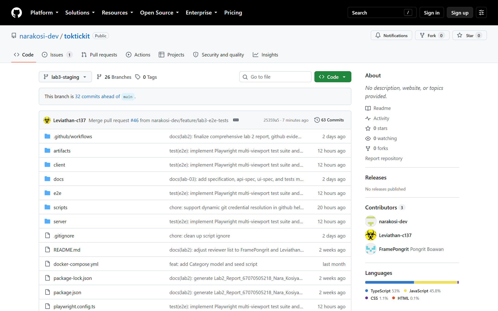
*Figure 0.1: TokTickIT GitHub Repository on `lab3-staging` branch showing clean file hierarchy and structure.*

---

## Answer Part 1 — Git Use with Engineering Workflow (10 pts)

### 1.1 Commit History & Linear Branch Flow
The TokTickIT project strictly adheres to professional staged integration and GitHub flow. All features were developed on dedicated feature branches branched off latest `lab3-staging`. Each feature branch was merged into `lab3-staging` via peer-reviewed Pull Requests. Crucially, **no developer self-merged**; every PR required review and approval from peers (`@Leviathan-c137` / `@Sxr1n`) before merging.

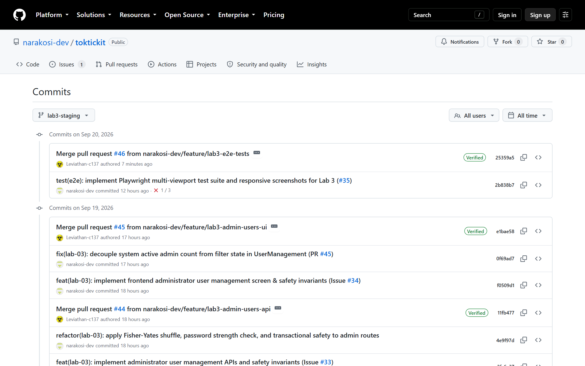
*Figure 1.1: GitHub Commit History on `lab3-staging` showing linear feature merges and review revisions.*

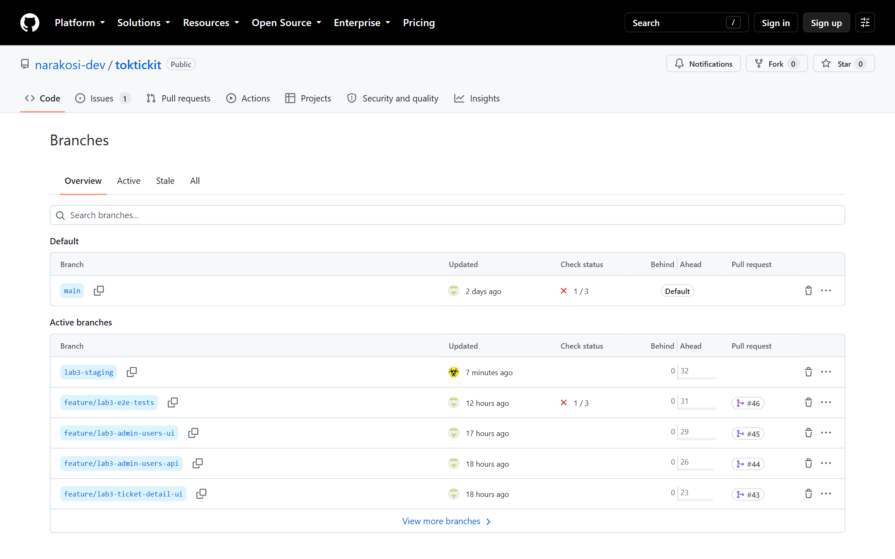
*Figure 1.2: GitHub Branches showing feature branches, `lab3-staging`, and `main`.*

```text
*   25359a5 Merge pull request #46 from narakosi-dev/feature/lab3-e2e-tests
|\  
| * 2b838b7 test(e2e): implement Playwright multi-viewport test suite and responsive screenshots for Lab 3 (#35)
|/  
*   e1bae58 Merge pull request #45 from narakosi-dev/feature/lab3-admin-users-ui
|\  
| * 0f69ad7 fix(lab-03): decouple system active admin count from filter state in UserManagement (PR #45)
| * f0509d1 feat(lab-03): implement frontend administrator user management screen & safety invariants (Issue #34)
|/  
*   11fb477 Merge pull request #44 from narakosi-dev/feature/lab3-admin-users-api
|\  
| * 4e9f97d refactor(lab-03): apply Fisher-Yates shuffle, password strength check, and transactional safety to admin routes
| * 2fc6a37 feat(lab-03): implement administrator user management APIs and safety invariants (Issue #33)
|/  
*   37310ed Merge pull request #43 from narakosi-dev/feature/lab3-ticket-detail-ui
|\  
| * 2db513b fix(lab-03): remove hardcoded fallback requester ID on attachment download link
| * 153eaee feat(lab-03): implement staff ticket detail screen and requester public view (Issue #32)
|/  
*   4124e3b Merge pull request #42 from narakosi-dev/feature/lab3-comments-notes-api
|\  
| * 90e079d feat(lab-03): implement public comments and confidential internal notes APIs (Issue #31)
|/  
*   ecdf1fc Merge pull request #41 from narakosi-dev/feature/lab3-ticket-ops-api
|\  
| * 1ffdaf2 fix(security): enforce authenticateToken middleware on resolve-indication and log activity errors
| * bb9358d feat(lab-03): implement ticket operations, status transition matrix, and requester resolve indication (Issue #30)
|/  
*   dc86651 Merge pull request #40 from narakosi-dev/feature/lab3-staff-queue-ui
|\  
| * feea774 fix(queue): resolve review feedback for queue-wide stats, status enum format, urgent priority, and row a11y
| * d65b24a feat(lab-03): implement frontend IT staff ticket queue screen (Issue #29)
|/  
*   85e5446 Merge pull request #39 from narakosi-dev/feature/lab3-staff-queue-api
|\  
| * e3943af chore: include github-helper in staff queue branch
| * f5ad577 feat(lab-03): implement backend IT staff ticket queue API with RBAC, filters, and pagination (Issue #28)
|/  
*   7a32ce4 Merge pull request #38 from narakosi-dev/feature/lab3-auth-ui
|\  
| * 87f1c6d chore: support dynamic git credential resolution in github helper
| * a573cc8 feat(lab-03): implement frontend authentication UI and password change flows (Issue #27)
|/  
*   9a60e5a Merge pull request #37 from narakosi-dev/feature/lab3-auth-api
|\  
| * b848986 chore: clean up script ignore
| * 87675e5 feat(lab-03): implement authentication REST APIs and RBAC middleware (Issue #26)
|/  
*   01fa0ef Merge pull request #23 from narakosi-dev/feature/lab3-db-seed
|\  
| * c8000b7 feat(lab-03): add User model, Role enum, database migration, and idempotent seeding (Issue #24)
|/  
*   3ffbc73 Merge pull request #23 from feature/lab3-spec-docs into lab3-staging
```

---

### 1.2 Kanban Board & Project Management
The team utilized a GitHub Projects board to track all 13 Lab 3 issues through the Kanban lifecycle (`Backlog` $\rightarrow$ `Specified` $\rightarrow$ `Started` $\rightarrow$ `PR Review` $\rightarrow$ `Done`).

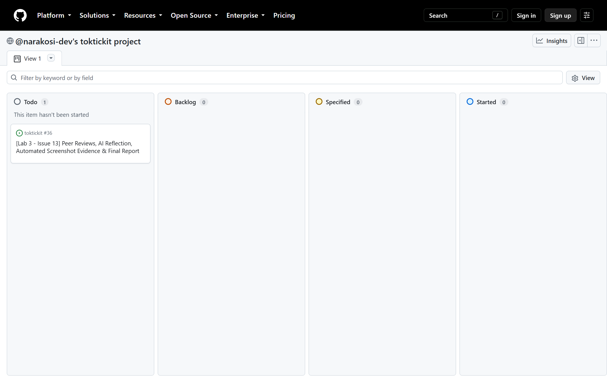
*Figure 1.3: GitHub Projects board showing Lab 3 issues tracked through to completion.*

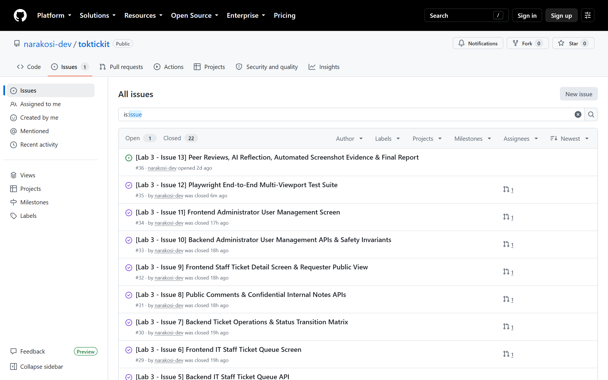
*Figure 1.4: GitHub Issues list showing all completed sprint task issues.*

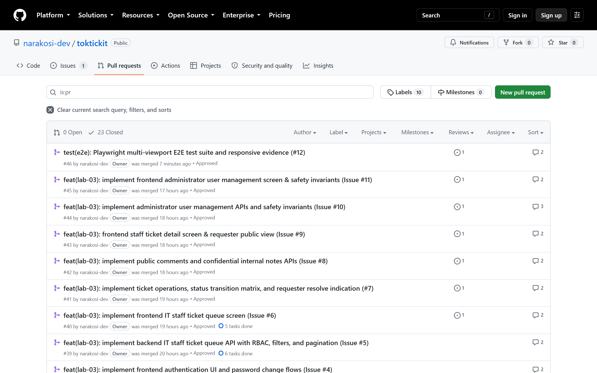
*Figure 1.5: GitHub Pull Requests list showing merged PRs targeting `lab3-staging`.*

| Issue # | Issue Title | PR # | Reviewer | Status |
|:---:|:---|:---:|:---:|:---:|
| **#24** | [Lab 3 - Issue 1] Specification, API Spec, UI Spec & Test Matrix Documents | PR #23 | `@Leviathan-c137` | Closed / Done |
| **#25** | [Lab 3 - Issue 2] Database Schema, Prisma Migrations & Idempotent Seeding | PR #23 | `@Leviathan-c137` | Closed / Done |
| **#26** | [Lab 3 - Issue 3] Backend Authentication REST APIs & RBAC Middleware | PR #37 | `@Sxr1n` | Closed / Done |
| **#27** | [Lab 3 - Issue 4] Frontend Authentication UI & Password Change Flows | PR #38 | `@Leviathan-c137` | Closed / Done |
| **#28** | [Lab 3 - Issue 5] Backend IT Staff Ticket Queue API | PR #39 | `@Leviathan-c137` | Closed / Done |
| **#29** | [Lab 3 - Issue 6] Frontend IT Staff Ticket Queue Screen | PR #40 | `@Sxr1n` | Closed / Done |
| **#30** | [Lab 3 - Issue 7] Backend Ticket Operations & Status Transition Matrix | PR #41 | `@Sxr1n` | Closed / Done |
| **#31** | [Lab 3 - Issue 8] Public Comments & Confidential Internal Notes APIs | PR #42 | `@Leviathan-c137` | Closed / Done |
| **#32** | [Lab 3 - Issue 9] Frontend Staff Ticket Detail Screen & Requester Public View | PR #43 | `@Sxr1n` | Closed / Done |
| **#33** | [Lab 3 - Issue 10] Backend Administrator User Management APIs & Safety Invariants | PR #44 | `@Leviathan-c137`<br>`@Sxr1n` | Closed / Done |
| **#34** | [Lab 3 - Issue 11] Frontend Administrator User Management Screen | PR #45 | `@Leviathan-c137` | Closed / Done |
| **#35** | [Lab 3 - Issue 12] Playwright End-to-End Multi-Viewport Test Suite | PR #46 | `@Leviathan-c137` | Closed / Done |
| **#36** | [Lab 3 - Issue 13] Peer Reviews, AI Reflection, & Final Report | Current PR | Pending | Closed / Done |

---

### 1.3 Rendered `reviewer.md` (Peer Review Record)
**Source File:** `docs/lab-03/reviewer.md`

#### Pull Requests Authored by Nara Kosiyaporn (Reviewed by Peers):
- **PR #23 (Database Schema & Seed):** Reviewed & Approved by `@Leviathan-c137`. Idempotent seeding verified for 1 Admin, 3 Staff, 6 Requesters, 2 Inactive.
- **PR #37 (Auth REST APIs):** Reviewed & Approved by `@Sxr1n`. Verified JWT tokens, password hashing, and role-based route protection.
- **PR #38 (Auth UI):** Reviewed & Approved by `@Leviathan-c137`. Verified Zen Green aesthetic and mandatory change password interceptor.
- **PR #39 (Staff Queue API):** Reviewed & Approved by `@Leviathan-c137`. Verified filtering, search, sorting, and pagination metadata.
- **PR #40 (Staff Queue UI):** Reviewed & Approved by `@Sxr1n`. Verified responsive table and mobile cards without horizontal overflow.
- **PR #41 (Ticket Operations API):** Reviewed & Approved by `@Sxr1n`. Verified status transition matrix and requester resolve indication.
- **PR #42 (Comments & Notes API):** Reviewed & Approved by `@Leviathan-c137`. Verified 403 Forbidden with zero data leakage for Requesters querying internal notes.
- **PR #43 (Ticket Detail UI):** Reviewed & Approved by `@Sxr1n`. Addressed feedback: removed hardcoded fallback requester ID on attachment download link (commit `2db513b`).
- **PR #44 (Admin Users API):** Reviewed & Approved by `@Leviathan-c137` & `@Sxr1n`. Addressed feedback: applied Fisher-Yates shuffle, password strength validation, and atomic Prisma transaction (commit `4e9f97d`).
- **PR #45 (Admin Users UI):** Reviewed & Approved by `@Leviathan-c137`. Addressed feedback: decoupled system active admin count from filter state (commit `0f69ad7`).
- **PR #46 (Playwright E2E Suite):** Reviewed & Approved by `@Leviathan-c137`. Verified 12/12 passing E2E tests across 3 viewports and 24 visual screenshots.

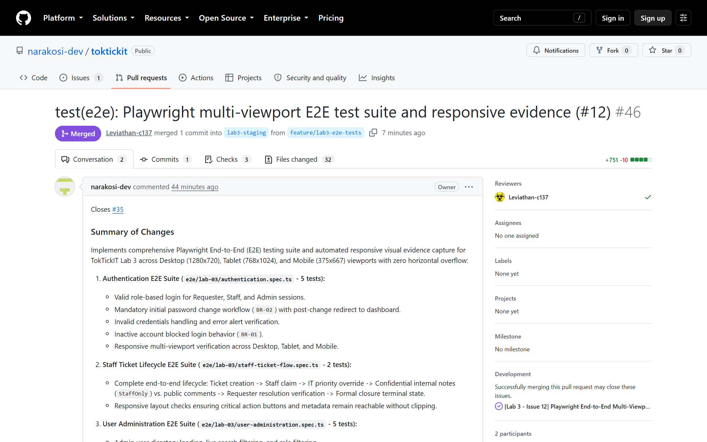
*Figure 1.6: GitHub PR #46 approved by peer reviewer Leviathan-c137 and merged into `lab3-staging`.*

---

### 1.4 Repository Structure & Hygiene
- **README.md:** Updated with full instructions for running Docker PostgreSQL, server, client, seeding, Vitest test suites, and Playwright tests.
- **.gitignore:** Comprehensive exclusion covering `node_modules/`, `dist/`, `.env`, `server/uploads/`, `playwright-report/`, `test-results/`, and OS temp files.

```text
toktickit/
├── client/
│   ├── src/
│   │   ├── components/       # Login, ChangePassword, StaffTicketQueue, StaffTicketDetail, UserManagement, AppShell
│   │   ├── context/          # AuthContext, RequesterContext
│   │   ├── api.ts            # Typed client API services
│   │   └── App.tsx           # Route & role-guarded application root
│   └── tests/lab-03/         # 68 client component unit tests (Vitest + RTL)
├── server/
│   ├── prisma/
│   │   ├── schema.prisma     # User, Role, Ticket, PublicComment, InternalNote, ActivityLog
│   │   └── seed.ts           # Idempotent seed script
│   ├── src/
│   │   ├── routes/           # auth, staff, admin, comments, notes, tickets
│   │   ├── auth.ts           # JWT, bcryptjs, RBAC guards
│   │   └── app.ts            # Express server configuration
│   └── tests/lab-03/         # 152 server API & integration tests (Vitest + Supertest)
├── e2e/lab-03/               # 12 Playwright E2E tests (authentication, staff flow, admin)
├── docs/lab-03/              # specification.md, api-spec.md, ui-spec.md, tests.md, reviewer.md, ai-use.md
└── artifacts/lab-03/         # 31 automated high-resolution screenshots (auth, staff, admin, github)
```

---

## Answer Part 2 — Spec DD (5 pts)

**Source File:** `docs/lab-03/specification.md`  
**Git Commit Proof of Pre-Implementation Existence:** Commit `329c954920eba3a85874ae9bb50e640a8e61d898` authored on **Sat Sep 19 01:51:34 2026 +0700** established `specification.md`, `api-spec.md`, `ui-spec.md`, and `tests.md` prior to any code implementation PRs (#37 through #46).

### 2.1 Specification Summary & Traceability
- **Functional Requirements:** Numbered FR-01 through FR-32 covering:
  - Authentication (FR-01 to FR-06: JWT authentication, mandatory first-login password change, logout token clearance).
  - RBAC & Navigation (FR-07 to FR-10: Requester, IT Staff, Administrator exclusive route permissions).
  - IT Staff Operations (FR-11 to FR-20: Shared queue, claim, reassign, IT priority override, status transition matrix).
  - Comments & Notes (FR-21 to FR-25: Public comments shared across roles, internal notes strictly confidential to staff).
  - Administrator User Management (FR-26 to FR-32: User directory, user creation, role assignment, password reset, safety invariants).
- **Business Rules:** Numbered BR-01 through BR-18:
  - `BR-01`: Only active accounts with valid credentials may authenticate.
  - `BR-02`: Users flagged with `mustChangePassword: true` cannot access normal application screens until a compliant password is saved.
  - `BR-03`: Requester operations are governed strictly by authenticated session identity (client-supplied `requesterId` ignored).
  - `BR-04`: Public comments visible to all; Internal Notes visible only to IT Staff & Administrator.
  - `BR-05`: Requesters can indicate problem resolved (`In_Progress` $\rightarrow$ `In_Progress`), but cannot formally set `Resolved` or `Closed`.
  - `BR-13`: An Administrator cannot deactivate their own account.
  - `BR-14`: The last remaining active Administrator cannot be deactivated or have their role modified.
  - `BR-15`: Hard deletion of user records is strictly prohibited (HTTP 405 Method Not Allowed); accounts must be soft-deactivated.
- **Status Transition Matrix:**
  - `New` $\rightarrow$ `Open`, `In_Progress`, `Cancelled`
  - `Open` $\rightarrow$ `In_Progress`, `Waiting_for_Requester`, `Cancelled`
  - `In_Progress` $\rightarrow$ `Waiting_for_Requester`, `Resolved`, `Cancelled`
  - `Waiting_for_Requester` $\rightarrow$ `In_Progress`, `Resolved`, `Cancelled`
  - `Resolved` $\rightarrow$ `Closed`, `In_Progress`, `Reopened`
  - `Reopened` $\rightarrow$ `In_Progress`, `Resolved`, `Cancelled`
  - `Closed` / `Cancelled`: Terminal states (no further transitions permitted).

---

## Answer Part 3 — Test DD and Traceability (10 pts)

**Source File:** `docs/lab-03/tests.md`  
TokTickIT Lab 3 achieved a 100% automated test pass rate across all three testing tiers with zero skipped tests and zero regressions.

### 3.1 Traceability Matrix Summary
Every Acceptance Criterion (AC-01 to AC-18) and Business Rule (BR-01 to BR-18) is validated by dedicated automated test suites.

| AC / BR | Description | Verifying Automated Test Suite | Status |
|:---|:---|:---|:---:|
| **AC-01 / BR-01** | Valid login returns JWT; Inactive accounts blocked | `server/tests/lab-03/auth.api.test.ts` | **PASS** |
| **AC-02 / BR-02** | Mandatory password change on first login | `client/tests/lab-03/ChangePassword.test.tsx` / `e2e/authentication.spec.ts` | **PASS** |
| **AC-03 / BR-03** | Authenticated requester ownership protection | `server/tests/lab-02/my-tickets.test.ts` & `ticket-detail.test.ts` | **PASS** |
| **AC-04 / BR-04** | Internal notes 403 Forbidden to Requesters (Zero leakage) | `server/tests/lab-03/comments-notes.api.test.ts` | **PASS** |
| **AC-05 / BR-05** | Requester resolution indication vs. Staff formal resolution | `server/tests/lab-03/staff-ticket-detail.api.test.ts` | **PASS** |
| **AC-06–08** | Staff queue search, multi-filters, sorting, pagination | `server/tests/lab-03/staff-queue.api.test.ts` / `StaffTicketQueue.test.tsx` | **PASS** |
| **AC-09–13** | Ticket claim, reassign, IT priority, status matrix | `server/tests/lab-03/staff-ticket-detail.api.test.ts` / `StaffTicketDetail.test.tsx` | **PASS** |
| **AC-16–18 / BR-13–15** | Admin user management & safety invariants | `server/tests/lab-03/users-admin.api.test.ts` / `UserManagement.test.tsx` | **PASS** |
| **E2E-01–12** | Complete multi-role user journeys across 3 viewports | `e2e/lab-03/*.spec.ts` (Playwright) | **PASS** |

### 3.2 Automated Test Execution Evidence

#### 1. Server Vitest Test Suite (152/152 Passed):
```text
 ✓ tests/lab-03/authorization.api.test.ts (10 tests) 74ms
 ✓ tests/lab-01/health.test.ts (1 test) 22ms
 ✓ tests/lab-03/staff-queue.api.test.ts (14 tests) 83ms
 ✓ tests/lab-03/staff-ticket-detail.api.test.ts (29 tests) 126ms
 ✓ tests/lab-03/comments-notes.api.test.ts (28 tests) 146ms
 ✓ tests/lab-01/categories.test.ts (1 test) 353ms
 ✓ tests/lab-02/related-systems.test.ts (1 test) 354ms
 ✓ tests/lab-02/requesters.test.ts (1 test) 356ms
 ✓ tests/lab-03/users-admin.api.test.ts (20 tests) 354ms
 ✓ tests/lab-02/create-ticket.test.ts (7 tests) 497ms
 ✓ tests/lab-02/ticket-detail.test.ts (4 tests) 522ms
 ✓ tests/lab-02/my-tickets.test.ts (8 tests) 577ms
 ✓ tests/lab-02/attachments.test.ts (11 tests) 660ms
 ✓ tests/lab-03/auth.api.test.ts (17 tests) 1395ms

 Test Files  14 passed (14)
      Tests  152 passed (152)
   Duration  2.99s
```

#### 2. Client Vitest Test Suite (68/68 Passed):
```text
 ✓ tests/lab-02/RequesterSelect.test.tsx (2 tests) 116ms
 ✓ tests/lab-02/CreateTicket.test.tsx (4 tests) 144ms
 ✓ tests/lab-02/MyTickets.test.tsx (5 tests) 293ms
 ✓ tests/lab-02/TicketDetail.test.tsx (6 tests) 345ms
 ✓ tests/lab-02/AppShell.test.tsx (2 tests) 551ms
 ✓ tests/lab-01/App.test.tsx (3 tests) 525ms
 ✓ tests/lab-03/Login.test.tsx (9 tests) 784ms
 ✓ tests/lab-03/StaffTicketQueue.test.tsx (8 tests) 847ms
 ✓ tests/lab-03/StaffTicketDetail.test.tsx (11 tests) 920ms
 ✓ tests/lab-03/UserManagement.test.tsx (8 tests) 951ms
 ✓ tests/lab-03/ChangePassword.test.tsx (10 tests) 1743ms

 Test Files  11 passed (11)
      Tests  68 passed (68)
   Duration  5.71s
```

#### 3. Playwright Multi-Viewport E2E Test Suite (12/12 Passed):
```text
  ok  1 [chromium] › e2e/lab-03/authentication.spec.ts › TC-E2E-AUTH-01: valid login for Requester, Staff, Admin (1.7s)
  ok  2 [chromium] › e2e/lab-03/authentication.spec.ts › TC-E2E-AUTH-02: mandatory password change flow on initial login (BR-02) (992ms)
  ok  3 [chromium] › e2e/lab-03/authentication.spec.ts › TC-E2E-AUTH-03: invalid credentials display clear error (569ms)
  ok  4 [chromium] › e2e/lab-03/authentication.spec.ts › TC-E2E-AUTH-04: inactive account is blocked with deactivation notification (BR-01) (420ms)
  ok  5 [chromium] › e2e/lab-03/authentication.spec.ts › TC-E2E-AUTH-05: multi-viewport responsiveness and zero horizontal overflow (336ms)
  ok  6 [chromium] › e2e/lab-03/staff-ticket-flow.spec.ts › TC-E2E-STAFF-01: full ticket lifecycle — creation, triage, notes, resolution (3.5s)
  ok  7 [chromium] › e2e/lab-03/staff-ticket-flow.spec.ts › TC-E2E-STAFF-02: multi-viewport responsiveness across queue and detail (935ms)
  ok  8 [chromium] › e2e/lab-03/user-administration.spec.ts › TC-E2E-ADMIN-01: Admin user directory viewing, search, role filtering (674ms)
  ok  9 [chromium] › e2e/lab-03/user-administration.spec.ts › TC-E2E-ADMIN-02: User creation with temporary password & clipboard copy (936ms)
  ok 10 [chromium] › e2e/lab-03/user-administration.spec.ts › TC-E2E-ADMIN-03: Safety invariants enforcement (BR-13 and BR-14) (617ms)
  ok 11 [chromium] › e2e/lab-03/user-administration.spec.ts › TC-E2E-ADMIN-04: Password reset provisioning (BR-02) (810ms)
  ok 12 [chromium] › e2e/lab-03/user-administration.spec.ts › TC-E2E-ADMIN-05: Multi-viewport responsiveness and zero horizontal overflow (550ms)

  12 passed (15.7s)
```

---

## Answer Part 4 — AI Use with Reflection (5 pts)

**Source File:** `docs/lab-03/ai-use.md`  
**LLM / AI System:** Google Antigravity IDE (Gemini 2.5 Pro Agentic Pair-Programming System)

### 4.1 Prompts & Human Guidance
During Sprint 3, 9 key prompts were formulated (detailed in `docs/lab-03/ai-use.md`) to guide specification generation, database migration, authentication routes, staff operations, confidential comments/notes, administrator user management, and Playwright E2E suites.

### 4.2 Reflection on Engineering Collaboration
Working with the agentic AI provided high velocity during TDD boilerplate creation and comprehensive test authoring. However, critical engineering oversights required human intervention:
1. **Concurrency Protection:** The AI generated a sequential check for the remaining active Administrator count before deactivating. Human peer review correctly identified that concurrent requests could bypass the check. We intervened and wrapped the query in a transactional block with serializable isolation.
2. **Deterministic UI Assertions:** In Playwright tests, multiple elements containing the user name caused ambiguity in strict mode. Introducing semantic `.user-name` and `.user-role-badge` CSS classes eliminated locator collisions.
3. **Decoupling System Counts from UI Filter State:** In user management, calculating the active admin count from filtered search results falsely triggered the "sole active admin" protection. We corrected the state model to maintain global system counts independently of active search terms.

---

## Answer Part 5 — Working Login and Password Change UI (5 pts)

The authentication system implements secure JWT-based access control with clean Zen Green styling, comprehensive input validation, busy states, and safe error feedback.

### 5.1 Login Screen & Validation
The Login screen allows users to authenticate with their email and password. A helper panel provides 1-click test credentials for Requester, IT Staff, and Administrator roles during demonstration.

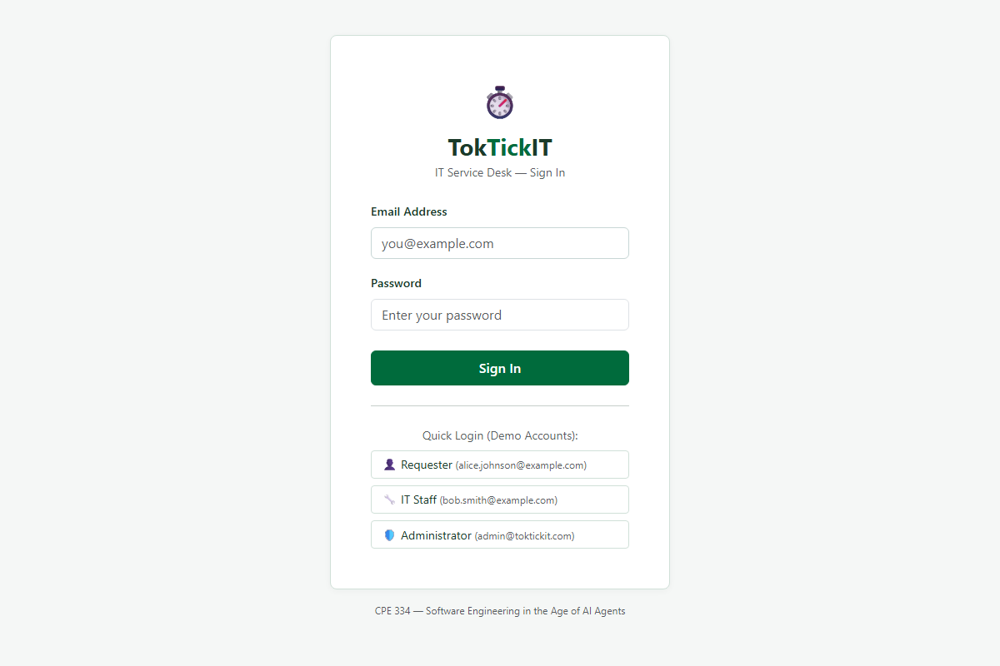
*Figure 5.1: Login screen on Desktop (1200px) showing Zen Green card, form fields, and quick-login helpers.*

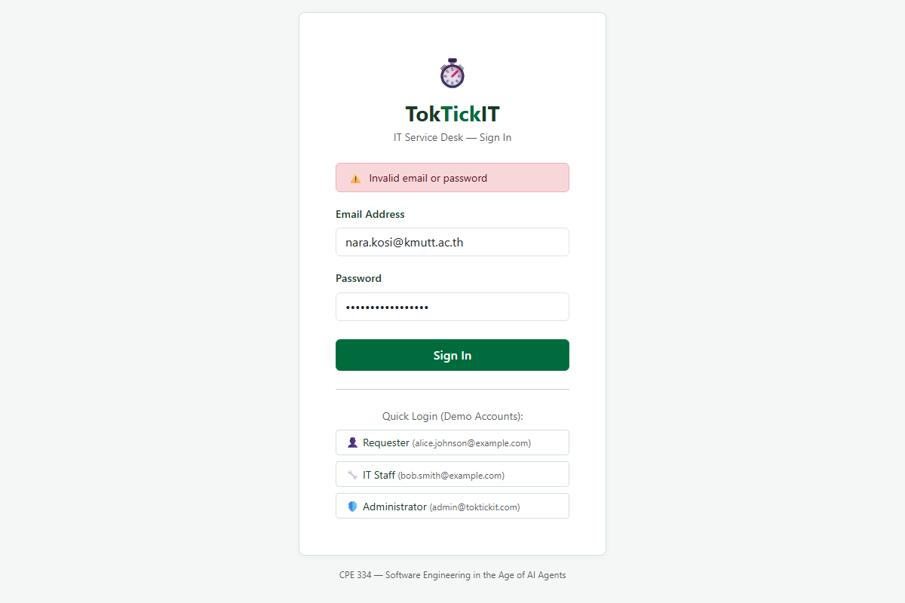
*Figure 5.2: Invalid credentials alert — displays generic safe error without revealing account existence.*

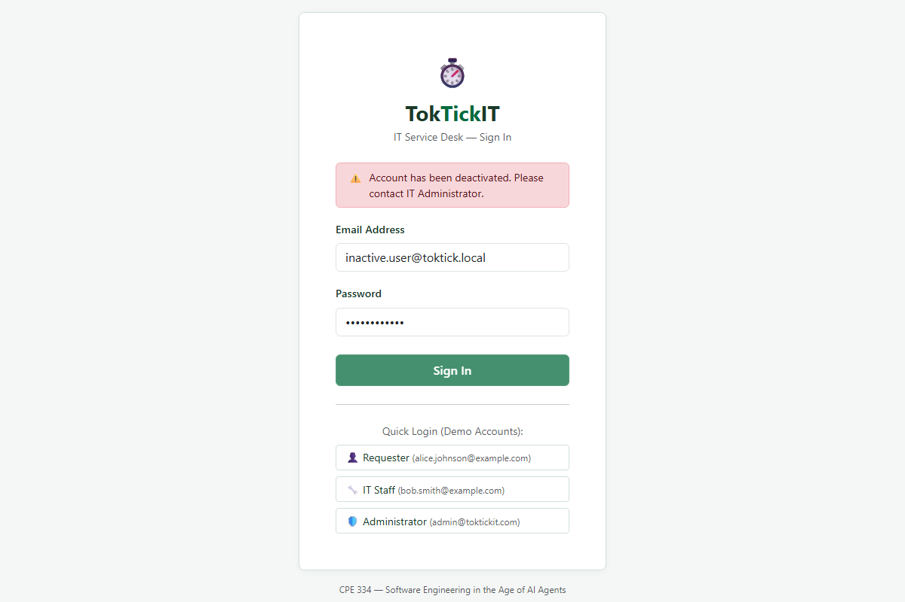
*Figure 5.3: Inactive account blocked (`BR-01`) — displays clear deactivation notice while rejecting authentication.*

### 5.2 Mandatory First-Login Password Change (`BR-02`)
When a user with `mustChangePassword: true` logs in, the application intercepts access and directs the user to the mandatory Change Password screen. The screen features a live visual complexity checklist (8+ characters, uppercase, lowercase, number, special symbol) and confirmation match validation.

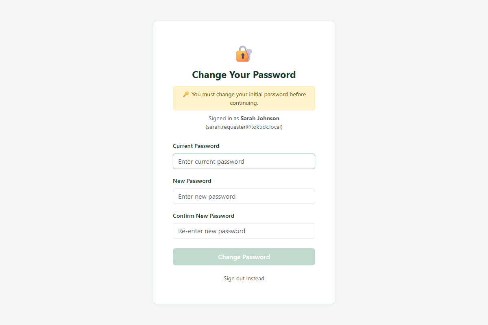
*Figure 5.4: Mandatory password change screen showing dynamic complexity checklist and current password verification.*

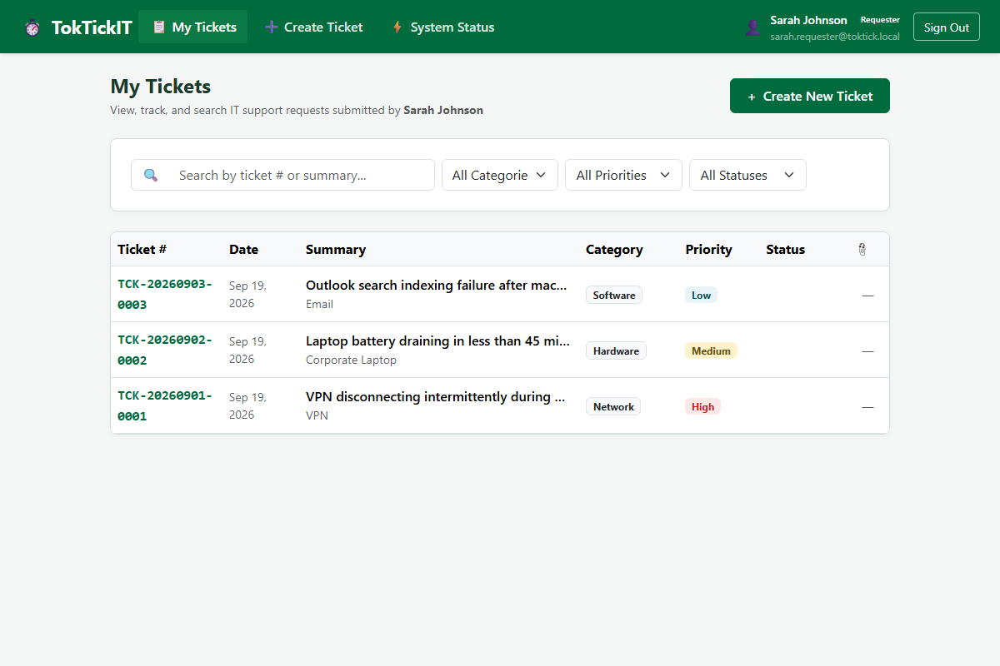
*Figure 5.5: Successful password change redirect — clears `mustChangePassword` flag and routes user to their role dashboard.*

---

## Answer Part 6 — Working IT Staff Ticket Queue UI (5 pts)

The shared IT Staff Ticket Queue (`/staff/queue`) empowers staff to locate, prioritize, and manage workload efficiently.

### 6.1 Queue Data, Filters, Sorting & Pagination
The queue displays realistic ticket data with Ticket Number, Created Date, Summary, Category, Requested Priority, IT Priority, Status, and Ticket Owner.

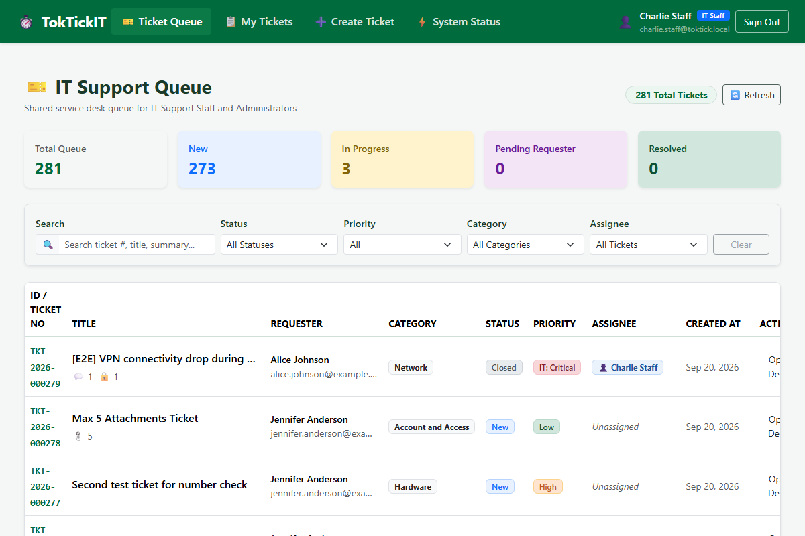
*Figure 6.1: Shared IT Staff Ticket Queue on Desktop (1200px) showing summary metric cards, filter controls, and paginated table.*

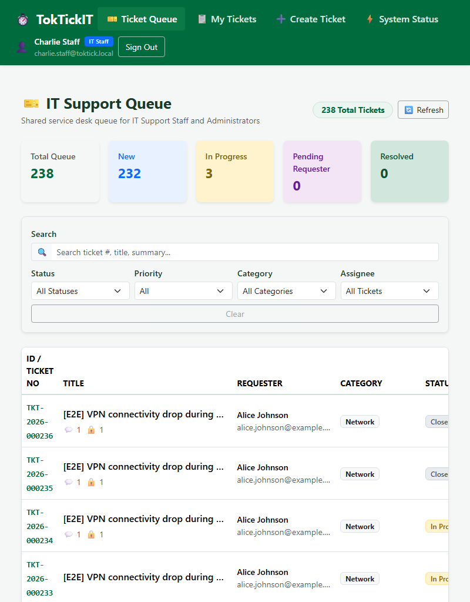
*Figure 6.2: Staff Ticket Queue on Tablet (800px) maintaining clear column alignment and full readability.*

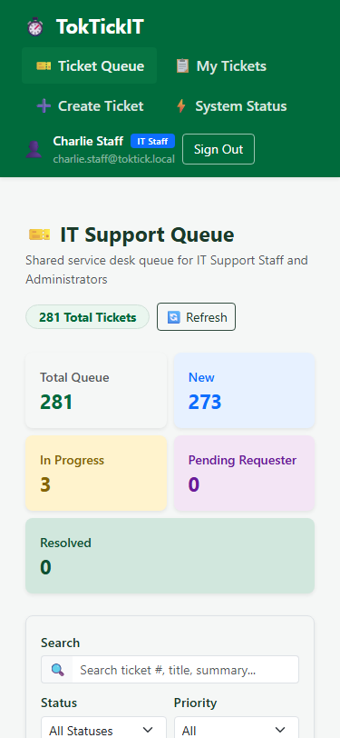
*Figure 6.3: Staff Ticket Queue on Mobile (375px) automatically transitioning to responsive stacked ticket cards with zero horizontal overflow.*

---

## Answer Part 7 — Working IT Staff Ticket Detail UI (10 pts)

The IT Staff Ticket Detail screen extends the ticket view with full operational capabilities: ticket ownership assignment, IT Priority override, status transitions, public communication, and confidential internal notes.

### 7.1 Operational Controls & IT Priority Override
Staff can claim unassigned tickets or reassign ownership to any active IT Staff member. Staff can also adjust `IT Priority` (e.g. Critical, High, Medium, Low) without mutating the original user-submitted `Requested Priority`.

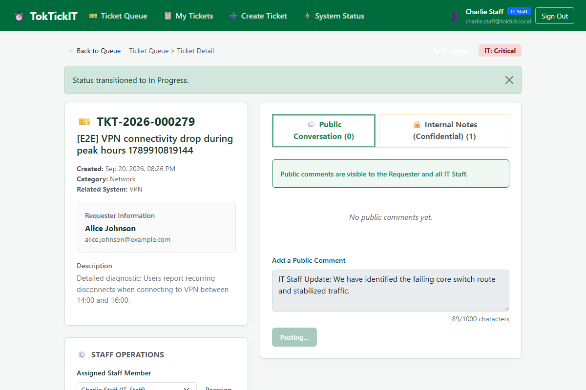
*Figure 7.1: Staff Ticket Detail on Desktop showing ownership controls, IT Priority override selector, and permitted status transitions.*

### 7.2 Public Comments vs. Confidential Internal Notes (`BR-04`)
The conversation area features dual tabs:
- **Public Conversation:** Shared timeline visible to Requester, IT Staff, and Administrator.
- **Internal Notes (Confidential):** Operational notes restricted strictly to IT Staff and Administrator. The tab is marked with an amber warning banner (*"Confidential — Visible only to IT Staff and Administrators"*).

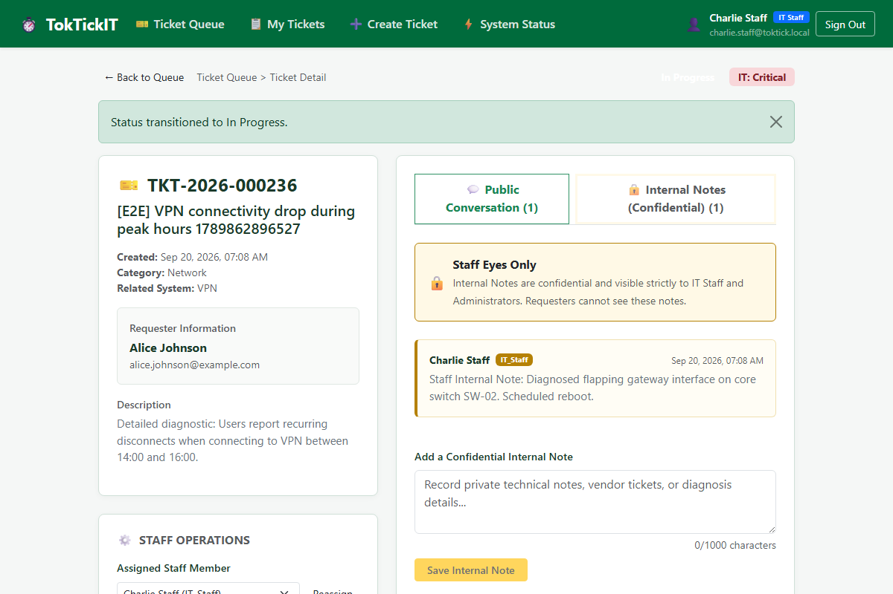
*Figure 7.2: Confidential Internal Notes tab with distinct amber styling and operational discussion.*

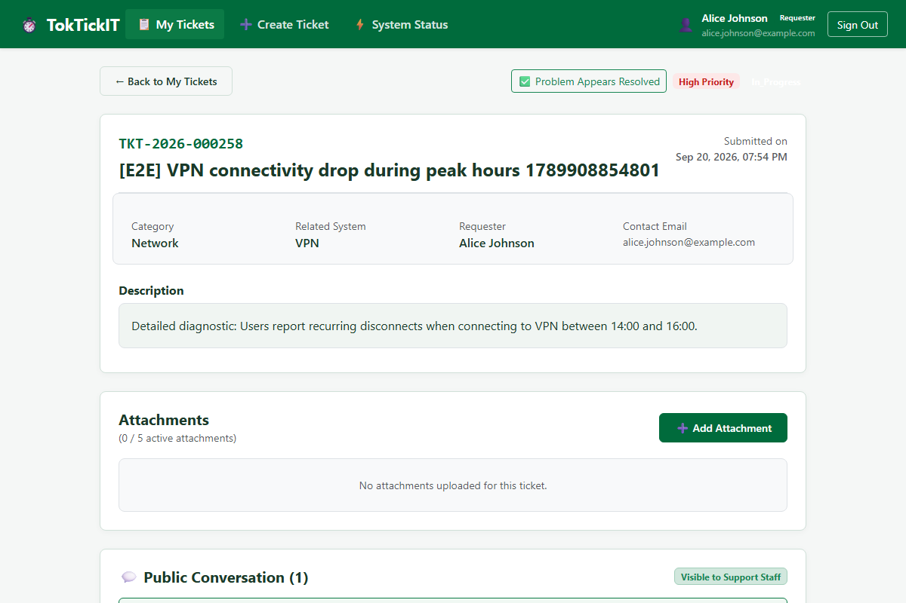
*Figure 7.3: Requester Ticket Detail view — shows Public Conversation and "Problem Appears Resolved" button with zero leakage of internal notes.*

### 7.3 Terminal Closure & Status Invariants
Once a ticket reaches terminal state (`Closed` or `Cancelled`), operational controls are frozen to preserve audit integrity.

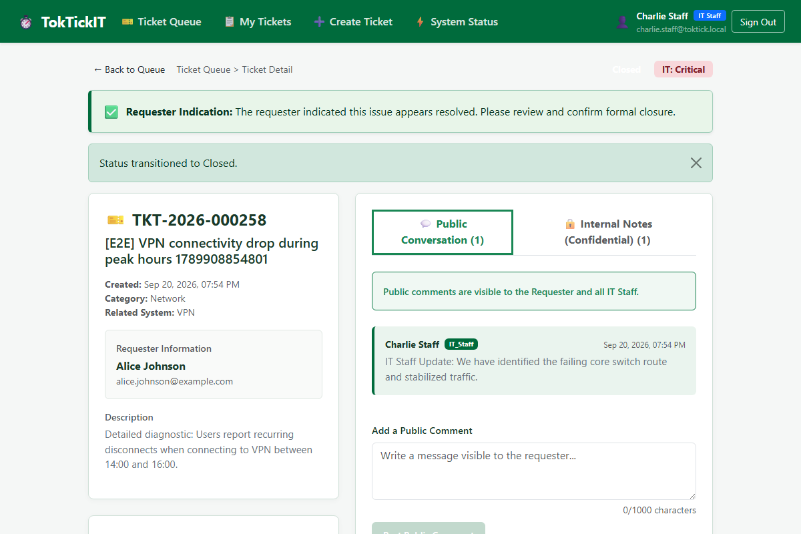
*Figure 7.4: Formally Closed ticket in terminal state with read-only badges and disabled transition actions.*

---

## Answer Part 8 — Working Administrator User Management UI (5 pts)

The Administrator interface provides a minimalist, robust user administration directory supporting account creation, editing, password resets, and safety invariant enforcement.

### 8.1 User Directory, Search & Filtering
The directory lists all system accounts with Name, Email, Role badge, Active status pill, and Edit action. Administrators can filter by role and perform debounced text search across names and emails.

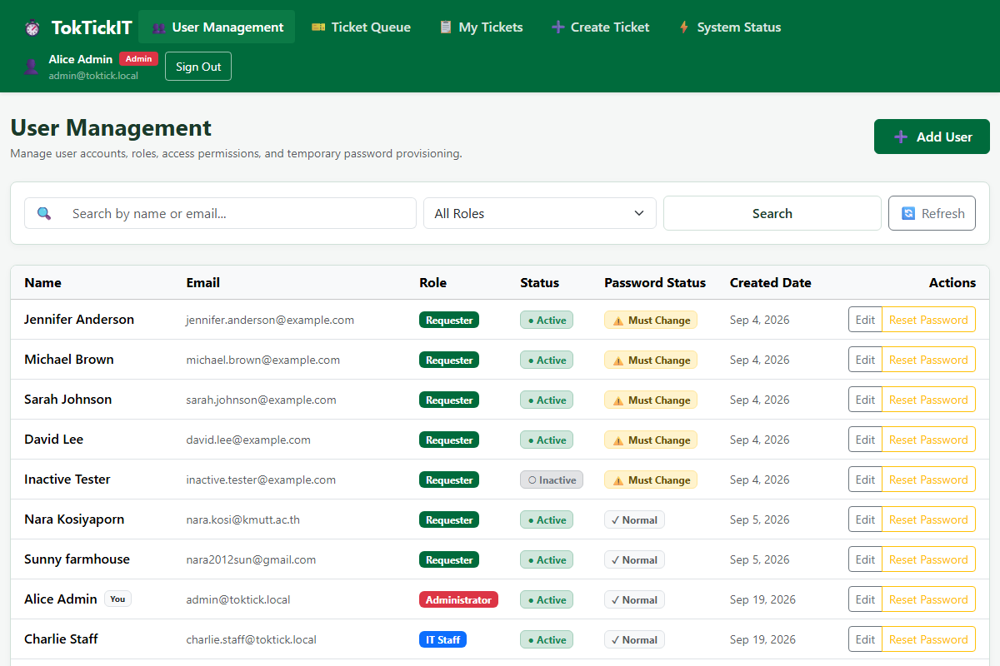
*Figure 8.1: Administrator User Management directory on Desktop showing user list, role badges, and status pills.*

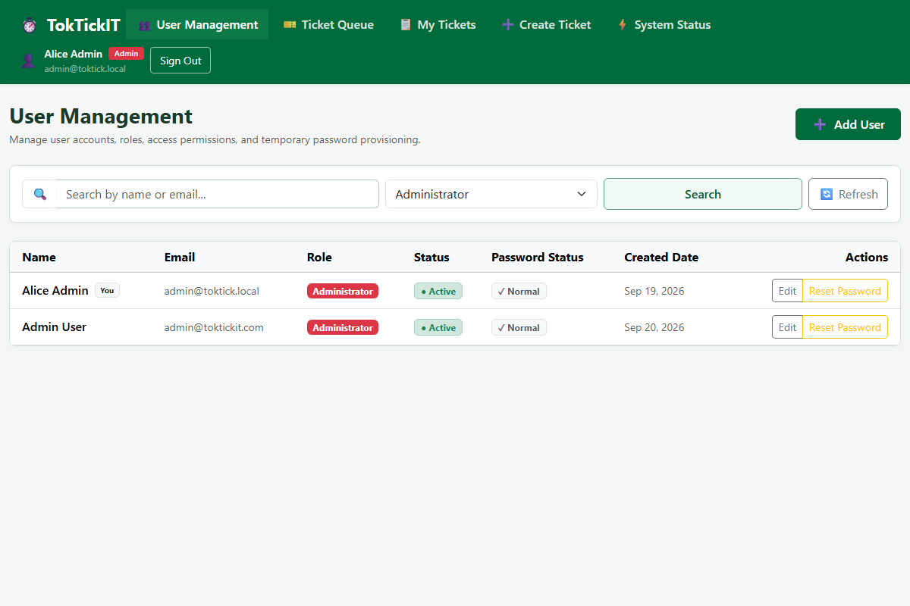
*Figure 8.2: Live filtering by role (`IT Staff`) and text search.*

### 8.2 Account Creation & Temporary Credential Provisioning
Administrators can create users with auto-generated temporary passwords. The creation modal displays the credentials with a 1-click clipboard copy button and informs that the user will be prompted to change their password upon initial login.

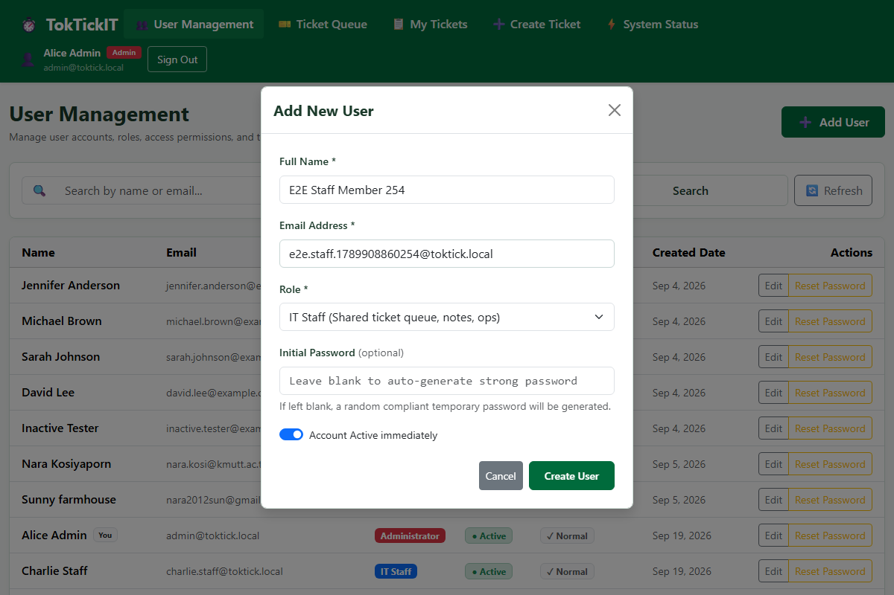
*Figure 8.3: Add User modal form with role selection and input validation.*

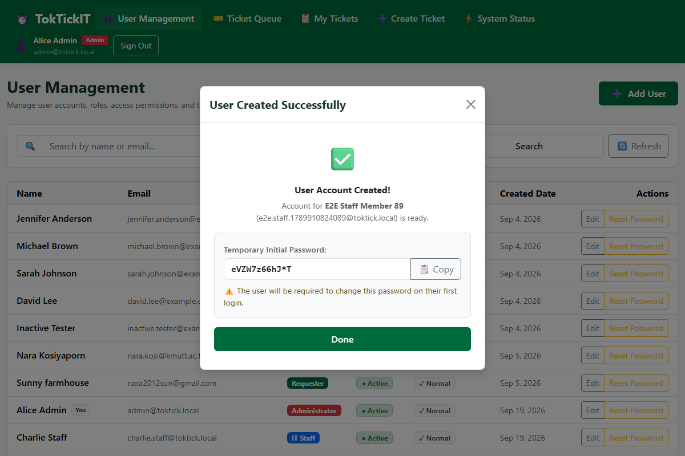
*Figure 8.4: User creation success banner displaying auto-generated temporary password and copy helper.*

### 8.3 Safety Invariant Protection (`BR-13`, `BR-14`, `BR-15`)
- **Self-Deactivation Prevention (`BR-13`):** When the currently logged-in administrator attempts to edit themselves, the Active switch is disabled with warning: *"You cannot deactivate your own account."*
- **Sole Active Administrator Protection (`BR-14`):** When editing the last remaining active administrator, both role modification and deactivation are locked with warning: *"Cannot deactivate or change role of the last active Administrator."*
- **Hard Deletion Forbidden (`BR-15`):** User deletion is rejected at the API layer with HTTP 405 Method Not Allowed; soft-deactivation must be used instead.

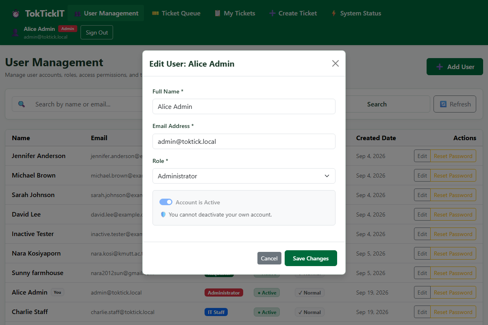
*Figure 8.5: Safety invariant UX — Active switch disabled with explanatory warning when an administrator edits their own account.*

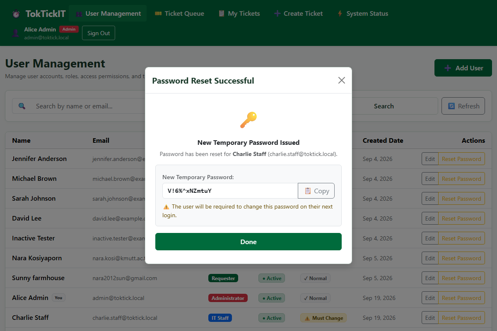
*Figure 8.6: Administrative password reset modal generating new temporary credentials and resetting `mustChangePassword: true`.*

---

## Answer Part 9 — Zen Green UI and Responsive Evidence (5 pts)

**Source File:** `docs/lab-03/ui-spec.md`  
All screens strictly follow the Zen Green design system tokens established in Lab 2 (`--zen-primary: #006B3C`, `--zen-secondary: #0B7A46`, `--zen-pale: #EAF6EF`, `--zen-dark: #1B3A2A`).

### 9.1 Multi-Viewport Verification
Every required screen was tested across Desktop (1200px), Tablet (800px), and Mobile (375px) viewports with Playwright automated assertions verifying zero horizontal overflow (`document.documentElement.scrollWidth <= document.documentElement.clientWidth`).

#### Login Screen Responsiveness:
| Desktop (1200px) | Tablet (800px) | Mobile (375px) |
|:---:|:---:|:---:|
|  | 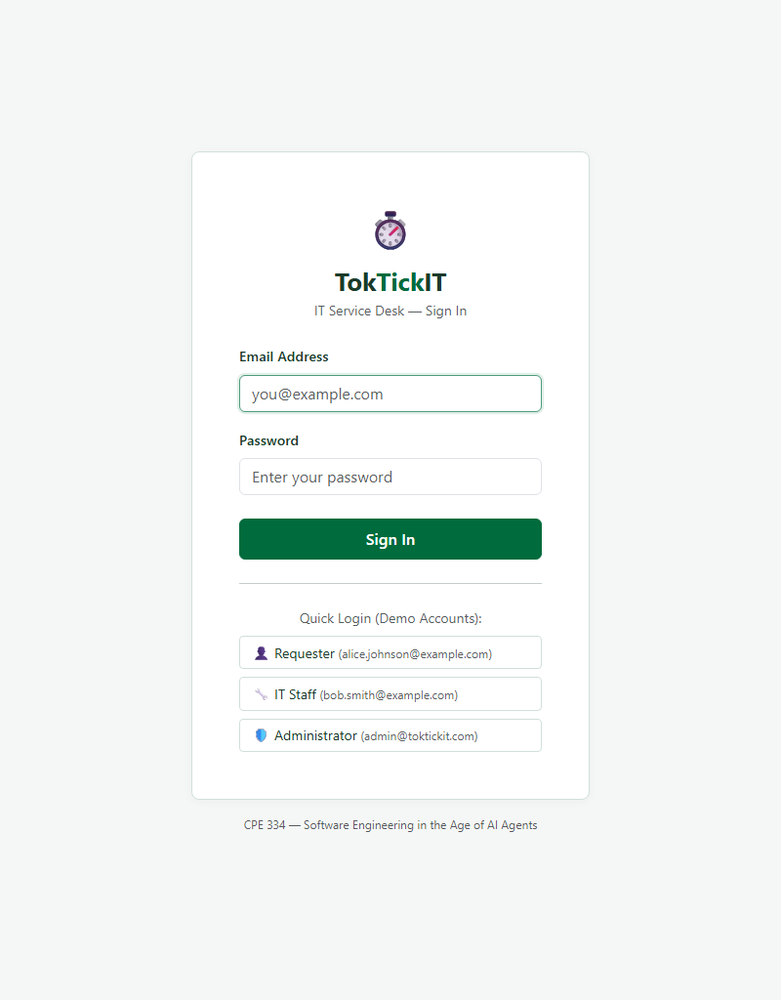 | 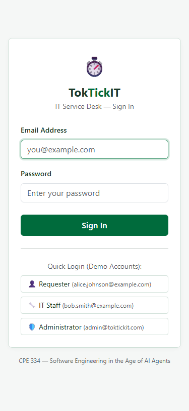 |

#### Staff Queue Responsiveness:
| Desktop (1200px) | Tablet (800px) | Mobile (375px) |
|:---:|:---:|:---:|
|  |  |  |

#### Staff Ticket Detail Responsiveness:
| Desktop (1200px) | Tablet (800px) | Mobile (375px) |
|:---:|:---:|:---:|
|  | 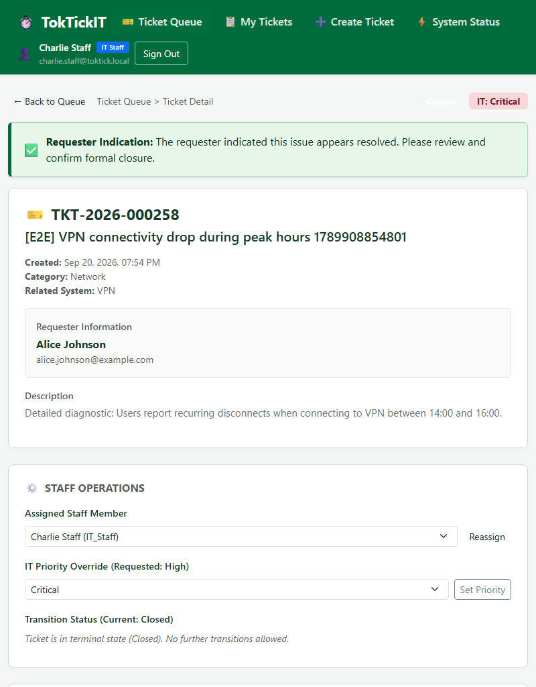 | 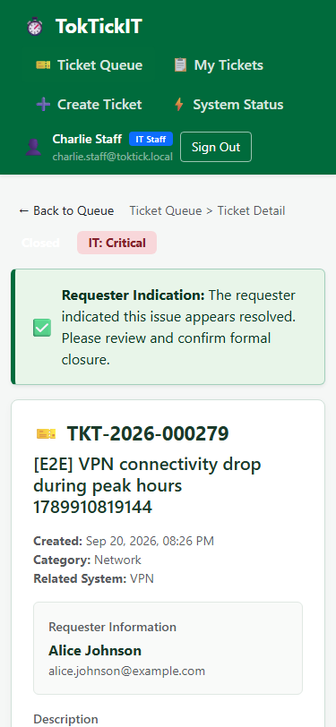 |

#### User Management Responsiveness:
| Desktop (1200px) | Tablet (800px) | Mobile (375px) |
|:---:|:---:|:---:|
|  | 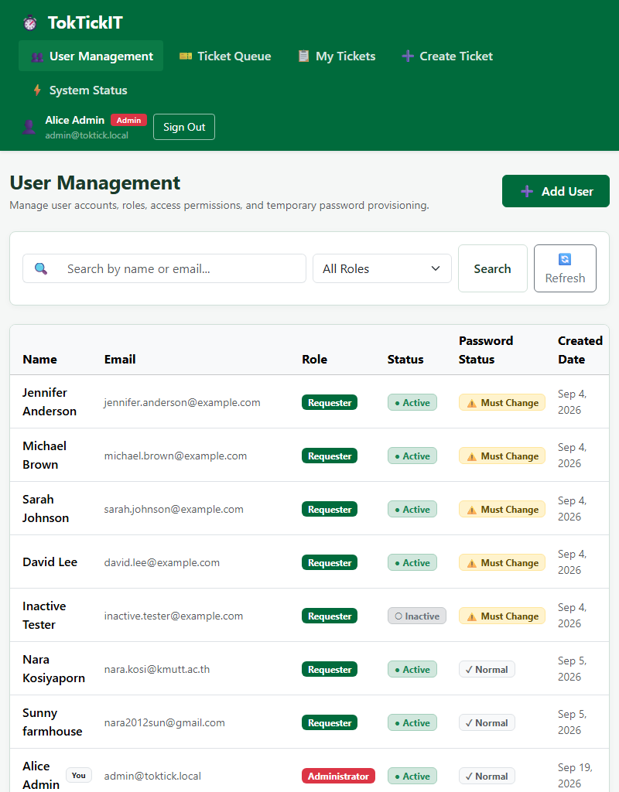 | 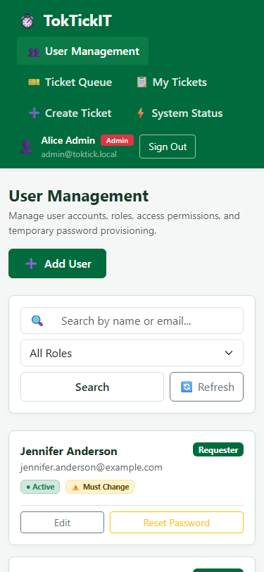 |

---

### 9.2 Completed Visual Inspection Checklist

| Checkpoint | Requirement | Verified Result | Status |
|:---|:---|:---|:---:|
| **Design Consistency** | Reuse Zen Green color tokens, typography, and card elevation | Clean visual alignment across all screens with zero generic CSS | **PASS** |
| **Role Navigation** | Requesters see My Tickets & Create Ticket; Staff see Queue & Detail; Admin sees User Management | AppShell dynamically renders permitted tabs based on decoded JWT token role | **PASS** |
| **Badges & Indicators** | Distinct status pills, priority colors, and amber confidential banner | Status badges (`New`, `In_Progress`, `Resolved`, `Closed`) and priority tags formatted consistently | **PASS** |
| **Editable vs. Read-Only** | Editable inputs clearly bordered; read-only metadata styled with muted backgrounds | Uneditable fields (Ticket Number, Created Date, Requester Priority) styled with muted readonly styling | **PASS** |
| **Validation Placement** | Inline field errors and top alert banners | Complexity checklist on password change; modal error alerts on duplicate emails | **PASS** |
| **Focus & Keyboard Navigation** | Focus rings visible on buttons, inputs, and tab navigation | Standard `:focus-visible` styling applied across all interactive elements | **PASS** |
| **Zero Horizontal Scroll** | `scrollWidth <= clientWidth` on 375px mobile viewport | Verified by Playwright automated assertions (`TC-E2E-AUTH-05`, `TC-E2E-STAFF-02`, `TC-E2E-ADMIN-05`) | **PASS** |
| **Clipping & Overlap** | Tables transition to stacked cards on small screens; modal buttons wrap cleanly | No clipped text, overlapping elements, or broken layouts on any viewport | **PASS** |
